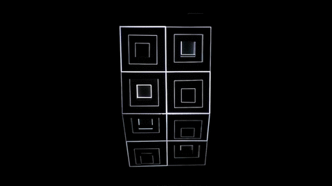
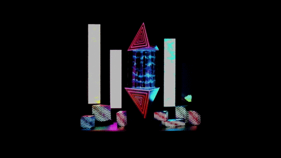
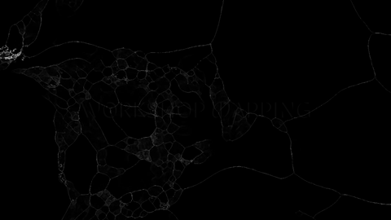
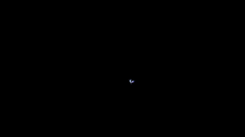

# workshop_mapping_cinetique_2020

Ce dépot regroupe les projets réalisés par des étudiants en motion design à l'école de design Nantes Atlantique dans le cadre d'un workshop de vidéo mapping utilisant [touch designer](https://derivative.ca/) et [arduino](https://www.arduino.cc/)

Les vidéos peuvent être consultées en intégralité dans la partie téléchargement de ce dépot [github](https://github.com/AtelierNum/workshop_mapping_cinetique_2020)

This repo stores the projects done by motion design students at l'École de design Nantes Atlantique during a video mapping workshop with [touch designer](https://derivative.ca/) and [arduino](https://www.arduino.cc/).

The full videos can be be found here : [github](https://github.com/AtelierNum/workshop_mapping_cinetique_2020)

## Vertige

**par Aline Bolzec, Camille Floch, Malo Leclercq et Fiona Marguerite**

[cahier de recherches](https://github.com/AtelierNum/workshop_mapping_cinetique_2020/Vertige/cahier_de_recherches.pdf)

## Elpis 59-M

**par Marthe Aubineau, Pierre Jolivet, Alexia Simon, Camille Vialet**

[cahier de recherches](https://github.com/AtelierNum/workshop_mapping_cinetique_2020/Elpis59M/cahier_de_recherches.pdf)

## Nebuleuse

**par Alix Le Bail, Hortense Mauny, Jules  Morice, Annaëlle Nemsguern**

[cahier de recherches](https://github.com/AtelierNum/workshop_mapping_cinetique_2020/Nebuleuse/cahier_de_recherches.pdf)

## Lightbreath

**par Manon Benoit, Marine Brosseau, Sophie Lambert, Neïla Melizi**

[cahier de recherches](https://github.com/AtelierNum/workshop_mapping_cinetique_2020/Lightbreath/cahier_de_recherches.pdf)

## Cristal Forest

**par Thomas Brouard, Romane Jubert, Candice Lambert, Anaïs Perbet**

[cahier de recherches](https://github.com/AtelierNum/workshop_mapping_cinetique_2020/Cristalforest/cahier_de_recherches.pdf)